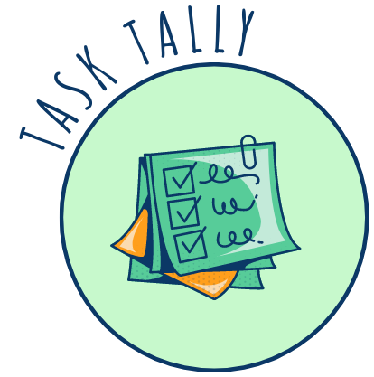
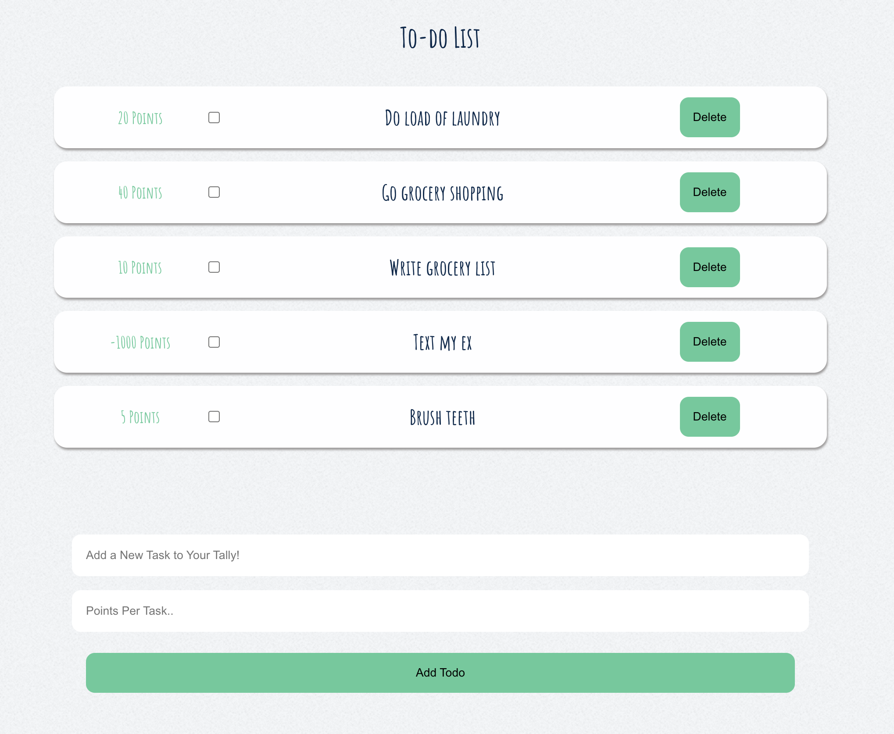
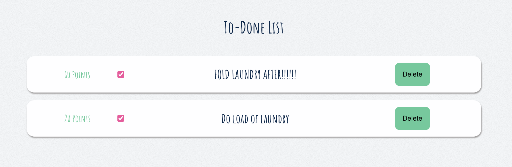
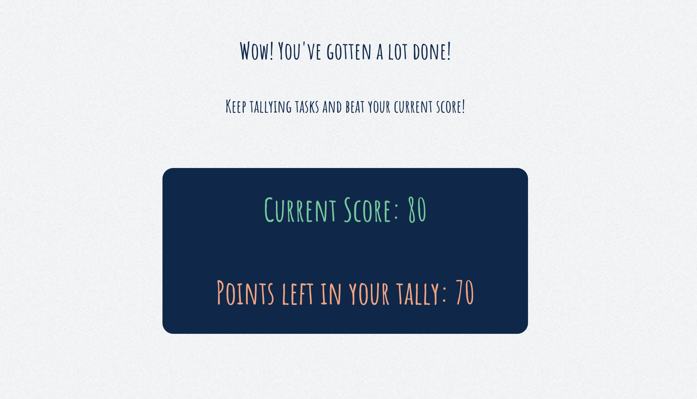
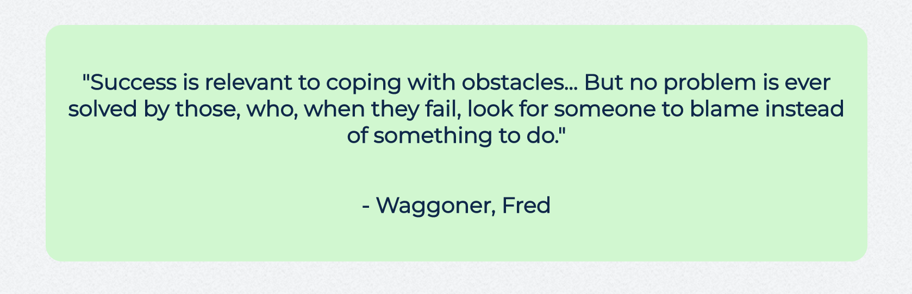

    

  

  Introducing Task Tally, the ultimate productivity app that turns your mundane to-do lists into an exciting game! Task Tally revamps the way you approach your tasks by allowing you to assign a score value to each item on your list, adding an element of fun and competition to your daily routine. Additionally motivational quotes are included on each page to provide inspiration and support for users striving to meet their goals.

  With Task Tally, you can create personalized to-do lists tailored to your unique needs. Whether it's work-related tasks, household chores, fitness goals, or personal projects, every item on your list now comes with its own point value. Assign higher scores to more challenging or time-consuming tasks, and lower scores to simpler ones. The choice is yours!

  

  - [Installation](#installation)
  - [Usage](#usage)
  - [Authors](#authors)
  - [Screenshots](#screenshots)

  

  * Access the deployed application at https://task-tally.herokuapp.com/ 

  * To run the app locally: Clone the code and from the root directory run `npm run install` for the dependencies, then `npm run develop`, and `npm run seed`

  
  

  To demo the application login with the username `tiny_lego_frog` and password `password789`  

  - Add new to-do items and their corresponding score under the 'To-Do' page
  - Check off task to remove them from the 'To-Do' page and add those items scores to your high score
  - Find completed tasks under the 'To-Done' page
  - Delete tasks from your To-do or To-Done page if you don't want to track that item and it's score
  - View your 'Current Score' and the total score of 'Points Left in Your Tally' under the 'Scores' page
  - Users can add negative value scores to stop them from doing a specific task (i.e. 'text my ex...' for -100)
    - Negative scores won't be counted in the 'Points Left to Earn in Your Tally' column, but if you complete a task with a negative tally, that point value will subtract from your 'Current Score' column

  

  

  [Emma Boushka](https://github.com/boushka9)

  [Samantha Gosselin](https://github.com/Samanthag2009)

  [Colin Nicosia](https://github.com/KrookedKickflip)

  [Joshua Boren](https://github.com/LukeNukem11)
  
  [Christian Killelea](https://github.com/chriskillelea)

  [Ashley "Haruhi" Martinez](https://github.com/AshSox)

  [Luis Martinez](https://github.com/LuisMtz-0)

  [Justin Crowson](https://github.com/JustinCrowson)
  

  

  This project is licensed under the terms of the MIT license 

  

  ---

  

        

  

  If you have any questions regarding this application please contact me through email or GitHub:

  boushka9@gmail.com

  boushka9

  

  

  

  

  

  